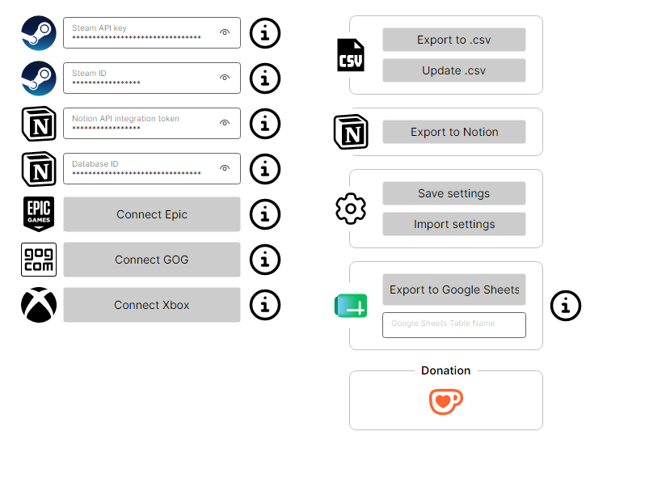
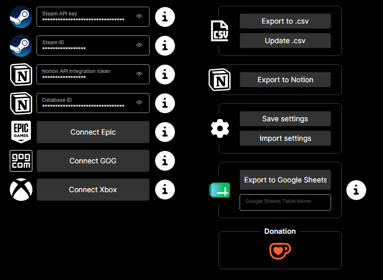
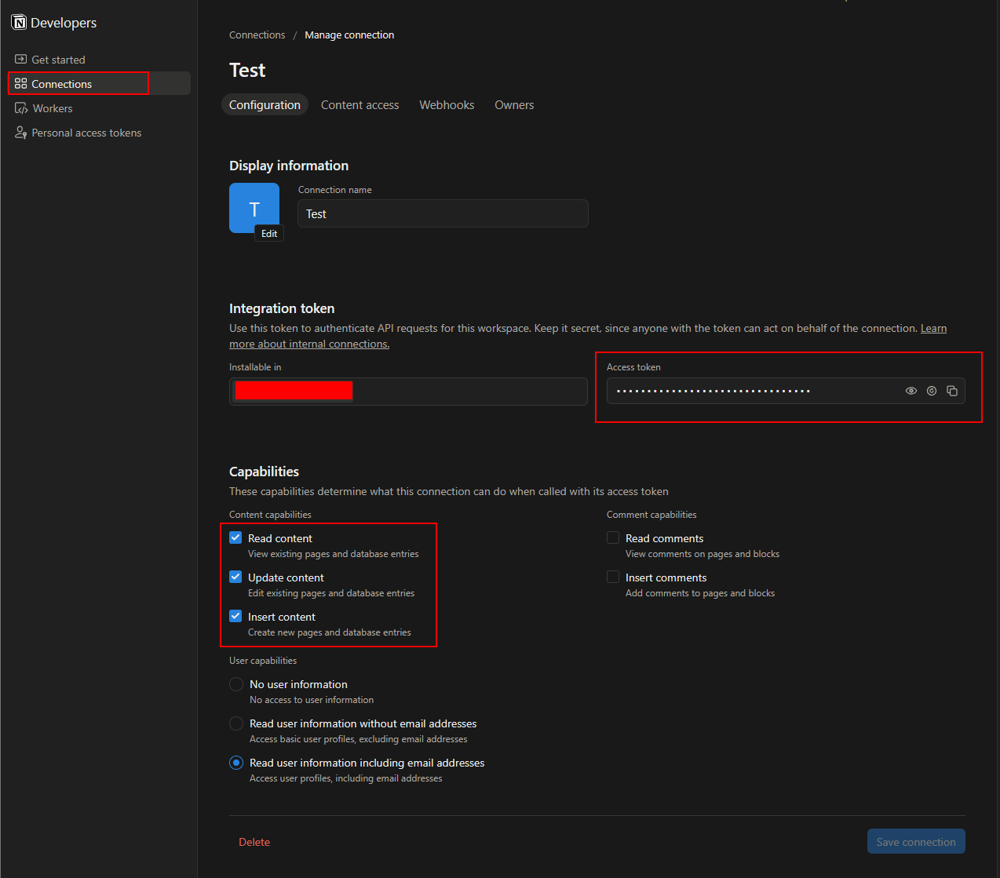
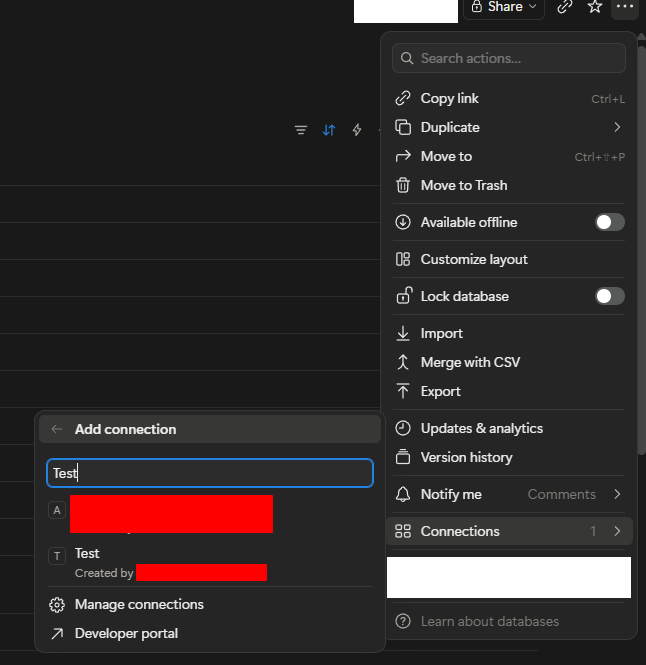
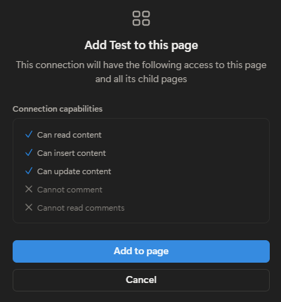
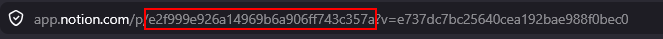
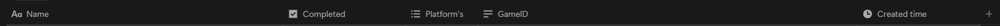

# SteamDb

A cross-platform (Windows / macOS / Linux) desktop app that pulls your owned games from
**Steam, Epic, GOG and Xbox** and syncs them into an external backlog tracker — **Notion**,
**Google Sheets**, or a local **CSV** — so you can see what you've completed, what's in
progress, and what you never even started.

It's built for people who buy a lot of games during sales and then lose track of their
backlog. SteamDb gathers every library into one merged list and keeps your tracker up to date.

Built on **.NET 9 + Avalonia 12** with the MVVM pattern.

---

## Table of contents

- [Download](#download)
- [Features](#features)
- [Getting started](#getting-started)
- [Connecting your stores](#connecting-your-stores)
  - [Steam](#steam)
  - [Epic Games](#epic-games)
  - [GOG](#gog)
  - [Xbox](#xbox)
- [Export targets](#export-targets)
  - [CSV](#csv)
  - [Notion](#notion)
  - [Google Sheets (beta)](#google-sheets-beta)
- [Privacy](#privacy)
- [License](#license)
- [Feedback and issues](#feedback-and-issues)

---

## Download

- [⬇️ Windows](https://github.com/AleksandrPidlozhevich/SteamDb/releases)
- [⬇️ macOS](https://github.com/AleksandrPidlozhevich/SteamDb/releases)
- [⬇️ Linux](https://github.com/AleksandrPidlozhevich/SteamDb/releases)

> 📷 _Screenshots of the main window:_
>
> | Light | Dark |
> | --- | --- |
> |  |  |

---

## Features

- **Four stores in one list** — fetches owned games from Steam, Epic, GOG and Xbox and merges
  duplicates (the same game owned on two stores becomes one row, tagged with both platforms).
- **Three export targets** — Notion database, Google Sheets, or a local CSV file.
- **Incremental sync** — re-running the export reconciles with what's already in the target
  (adds new games, updates platform tags) instead of creating duplicates.
- **Cancellable** — every export shows a progress bar with a Cancel button.
- **Secure by default** — store refresh tokens and remembered credentials are cached
  **encrypted** (DPAPI on Windows, Keychain on macOS, libsecret on Linux) and refreshed
  automatically.
- **Cross-platform** — one app for Windows, macOS and Linux.

---

## Getting started

1. Download and run the app for your OS (see [Download](#download)).
2. Connect at least one store (see [Connecting your stores](#connecting-your-stores)).
3. Pick an export target and run the export (see [Export targets](#export-targets)).

---

## Connecting your stores

### Steam

Steam works with a **Steam ID** plus a Steam Web API key — no login through the app.

#### 1. Find your Steam ID

**Via Steam Desktop App:**

1. Open Steam and click your **username** in the top-right corner.
2. Select **Account details** from the dropdown.
3. At the top of the window you'll see your Steam display name in large font.
   Below that is your **Steam ID** — a long number (usually 17 digits).
4. Copy and save this number.

#### 2. Get your Steam Web API Key

1. Go to [Steam Web API key page](https://steamcommunity.com/dev/apikey)
2. Sign in to your Steam account if prompted
3. Accept the **Steam Web API Terms of Use**
4. Enter a domain name (any name is fine, e.g., `steamdb-local`) and click **Register**
5. Your **API key** will be displayed — a long alphanumeric string
6. Copy and save this key

📘 Reference: [Official Steam Web API Documentation](https://developer.valvesoftware.com/wiki/Steam_Web_API)

> ⚠️ **Keep your Steam ID and API key private!** Never share them publicly or commit them to version control.

### Epic Games

Epic's login blocks embedded webviews (CAPTCHA), so you log in via your **system browser**:

1. Click **Connect** on the Epic card — your default browser opens Epic's login page.
2. Sign in. After signing in, Epic shows a page containing an **authorization code**.
3. Copy the code and paste it into the app (it's also picked up automatically from the
   clipboard when possible).

### GOG

GOG logs in through an **embedded WebView** inside the app:

1. Click **Connect** on the GOG card — a login window opens.
2. Sign in. The authorization code is read automatically from the redirect; the window closes
   on its own.

### Xbox

Xbox also logs in through an **embedded WebView**:

1. Click **Connect** on the Xbox card — a Microsoft login window opens.
2. Sign in with your Microsoft account. The token is read from the redirect; the window closes
   on its own.
3. Game Pass titles are flagged on a best-effort basis.

> Once connected, each store's session is cached **encrypted** and refreshed automatically —
> you won't need to log in again every time.

---

## Export targets

### CSV

The simplest target — no account or token needed.

- **Export to CSV** writes the full merged library to a CSV file you pick.
- **Update CSV** merges the current library into an existing CSV, preserving your completion
  status and avoiding duplicates.

The file is written as UTF-8 with a BOM so it opens cleanly in Excel.

### Notion

To sync into Notion you need a Notion **integration token**, a **database ID**, and a database
with the **right properties**.

#### 1. Create an integration and get the token

1. Go to the [Notion integrations page](https://www.notion.so/profile/integrations).
2. Click **"New integration"**.
3. Fill in the name and select the workspace where the integration will be used.
4. Once created, copy the **Internal Integration Token** (a long string starting with
   `ntn_...`).
5. Save this token somewhere safe — you'll need it in the app settings.

🛡️ Grant the integration the following capabilities:

- ✅ `Read content`
- ✅ `Update content`
- ✅ `Insert content`

> 📷 _Example screenshots:_
>
> | | |                                                  |
> | --- | --- |--------------------------------------------------|
> |  |  |  |

#### 2. Share the database with the integration

**Share the target Notion database** with the integration (the same way you'd share it with a
person), otherwise the app can't see or write to it.

#### 3. Find your database ID

1. Open your Notion workspace and navigate to the target database.
2. Look at the URL in your browser.
3. The **Database ID** is the part right after the last slash and before the question mark `?`.
   It is a 32-character alphanumeric string.

> ℹ️ You still copy the **database ID** from the URL — that hasn't changed. Internally the app uses
> Notion API version `2025-09-03`, which resolves the database's data source automatically, so no
> extra setup is required on your side.

📘 Reference: [Official Notion Docs — Retrieve a database](https://developers.notion.com/reference/retrieve-database)
· [Retrieve a data source](https://developers.notion.com/reference/retrieve-a-data-source)
· [Upgrading to 2025-09-03](https://developers.notion.com/guides/get-started/upgrade-guide-2025-09-03)

> 📷 _Example screenshot:_
> 

#### 4. Required database properties

The target database **must** have these properties (names are case-sensitive):

| Property      | Type           | Holds                                                        |
| ------------- | -------------- | ----------------------------------------------------------- |
| `Name`        | Title          | The game's title                                            |
| `Platform's`  | Multi-select   | The store(s) the game is owned on (Steam, Epic, GOG, Xbox)  |
| `GameID`      | Text           | Platform-prefixed id(s), e.g. `Steam:236870; GOG:123`       |

> 📷 _Example screenshot:_
> 

### Google Sheets (beta)

Authorization with Google Sheets uses standard Google OAuth.

- ⚠️ Integration is in **beta** — in some cases the authentication flow may not work correctly
  yet, and some features may be unstable or unavailable.

🔧 We're working on improving this — thank you for your patience!

---

## Privacy

SteamDb does not collect, store, or transmit any personal data to its developer. Logs and
cached credentials stay on your device (credentials encrypted). See [PRIVACY_POLICY.md](PRIVACY_POLICY.md).

---

## License

MIT

---

## Feedback and issues

aleksandr.pidlozhevich@gmail.com